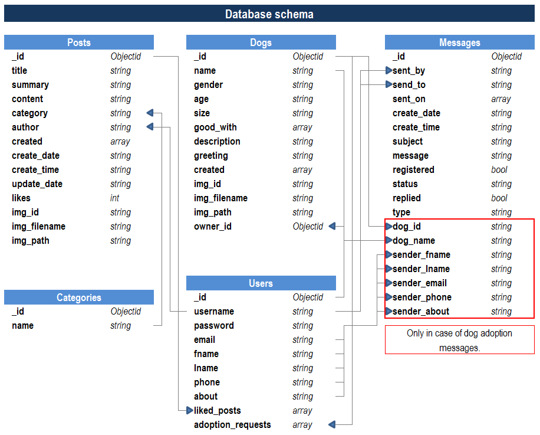

# woof(dot)com

[Click for live website](http://woofdotcom.herokuapp.com/)

**woof(dot)com** is web portal for dog lovers and it is part of my 3nd milestone project in **Code Institute's Full Stack Software Development Course**. This site is intended for all dog lovers to share their posts with community, to find new homes for their dogs in case they cannot keep them anymore, and for those who would like to adopt a dog.


---

# TABLE OF CONTENTS:

- [USER EXPERIENCE](#user-experience)
  -  [User stories](#user-stories)
    -  [First time visitors goals](#first-time-visitors-goals)
    -  [Frequent users goals](#frequent-users-goals)
    -  [Site owners goals](#site-owners-goals)
- [WIREFRAMES](#wireframes)
- [DATABASE SCHEMA](#database-schema)
  -  [Users collection](#users-collection)
  -  [Posts collection](#posts-collection)
  -  [Dogs collection](#dogs-collection)
  -  [Messages](#messages)
  -  [Categories](#categories)
- [TECHNOLOGIES USED](#technologies-used)
  -  [Languages](#languages)
  -  [Frameworks, libraries, programs and websites](#frameworks-libraries-programs-and-websites)
- [DESIGN](#design)
  -  [Colour scheme](#colour-scheme)
  -  [Imagery](#imagery)
  -  [Typography](#typography)
* [FEATURES AND FUNCTIONALITY](#features-and-functionality)
  -  [Registration](#registration)
  -  [Updating profile](#updating-profile)
  -  [Navigating through the site](#navigating-through-the-site)
  -  [Index page](#index-page)
      -  [Latest posts](#latest-posts)
      -  [Newest dogs](#newest-dogs)
  -  [Posts page](#posts-page)
  -  [Dogs page](#dogs-page)
  -  [Dog surrender page](#dog-surrender-page)
  -  [Adding new post or new dog ad](#adding-new-post-or-new-dog-ad)
  -  [Editing and deleting post or dog ads](#editing-and-deleting-post-or-dog-ads)
  -  [Liking a post](#liking-a-post)
  -  [Adopting a dog](#adopting-a-dog)
  -  [Contact form](#contact-form)
  -  [Inbox](#inbox)
- [TESTING](#testing)
  -  [Code tests](#code-tests)
  -  [Testing User Stories from User Experience Section](#testing-user-stories-from-user-experience-section)
    -  [First time visitors goals](#first-time-visitors-goals)
    -  [Frequent users goals](#frequent-users-goals)
    -  [Site owners goals](#site-owners-goals)
  -  [Responsiveness and browser tests](#responsiveness-and-browser-tests)
  -  [Manual testing](#manual-testing)
  -  [Known bugs](#known-bugs)
  -  [Fixed bugs](#fixed-bugs)
- [DEPLOYMENT](#deployment)
  -  [Creating repository on GitHub](#creating-repository-on-github)
  -  [Deploying project on Heroku](#deploying-project-on-heroku)
  -  [Forking repository](#forking-repository)
  -  [Cloning repository](#cloning-repository)
- [CREDITS](#credits)
  -  [Code credits](#code-credits)
  -  [Media and content credits](#media-and-content-credits)
  -  [Acknowledgements](#acknowledgements)

---

## USER EXPERIENCE

### User Stories

#### First time visitors goals

- *As a first time visitor*, I want to clearly see the purpose of the site and to easily navigate throughout the site

- *As a first time visitor*, I want to see dog content which is divided into easily understandable and well structured sections.

- *As a first time visitor*, I want to be able to use search tools to filter content by specific criteria

- *As a first time visitor*, I want to be able to contact the site owner

- *As a first time visitor*, I want to be able to create account which will give me more options on the site

#### Frequent users goals

- *As a frequent user*, I want to be able to write my own content and to share it with other users of the site

- *As a frequent user*, I want to be able to add dogs and their info to the dog database on the site

- *As a frequent user*, I want to be able to edit or delete all the content created by myself at any time

- *As a frequent user*, I want to be able to give positive feedback to other users who are posting their content to the site

- *As a frequent user*, I want to be able to send and withdraw applications for adopting dogs

- *As a frequent user*, I want to be able to easily communicate with site owner or admin

- *As a frequent user*, I want to be able to make changes to my profile

#### Site owners goals

- *As a site owner*, I want to provide a platform for users to share their knowledge, experiences, advices and passion for dogs

- *As a site owner*, I want to provide service and support for dog owners to re-home their dogs if they cannot keep them for any reason anymore

- *As a site owner*, I want to provide messaging tools between site users and myself as integrated part of the site

- *As a site owner*, I want to promote social media links to grow the community

---

## WIREFRAMES

- [Mobile view](static/documentation/wireframes/mobile.pdf)
- [Tablet view](static/documentation/wireframes/tablet.pdf)
- [Desktop view](static/documentation/wireframes/desktop.pdf)

---

## DATABASE SCHEMA

Database for this project includes 5 collections (*users*, *categories*, *posts*, *dogs* and *messages*).

### Users collection

Document in 'users' collection consists of 10 fields (including default _id field). Fields *liked_posts* and *adoption_requests* are arrays which get their values from documents in *post* and *dog* collections. All other fields are populated by direct user input.

### Posts collection

Document in 'posts' collection consists of 14 fields (including default _id field). Fields *img_id*, *img_filename* and *img_path* are generated inside python code and their purpose is to give unique identifying attributes to specific post document. Fields *created*, *create_date*, *create_time* and *update_time* are also generated inside python code with *datetime* module and their purpose is to manipulate posts by time criteria. *Like* field is integer type and it changes depending on users action (like button on post page). *Author* field is populated from a document in 'users' collection. *Category* filed is populated from a document in 'categories' collection. Fields *title*, *summary* and *content* are populated by direct user input.

### Dogs collection

Document in 'dogs' collection consists of 13 fields (including default _id field). Fields *img_id*, *img_filename* and *img_path* are generated inside python code and their purpose is to give unique identifying attributes to specific dog document. *Owner_id* field is of *ObjectId* type and it is received from a document in 'users' collection'. *Created* field is generated inside python code with *datetime* module and its purpose is to manipulate dogs by time criteria. Fields *name*, *gender*, *age*, *size*, *good_with*, *description* and *greeting* are populated by direct user input.

### Messages

Document in 'messages' collection consists of 17 fields (including default _id field). Messages collection is specific when compared to other collections in this project because messages can be of two types - standard message or adoption request. Standard message document has 10 fields, and adoption request adds additional 7 fields (info about a dog for which user applied). Adoption request fields are: *sender_fname*, *sender_lname*, *sender_email*, *sender_phone*, *sender_about* (all of them are received from a document in 'users' collection), *dog_name* and *dog_id* (received from document in 'dogs' collection). Standard message fields are: *type*, *replied*, *status*, *sent_on*, *create_date*, *create_time*, *registered* (all generated within python code), *sent_by*, *send_to* (received from document in 'users' collection), *subject* and *message* which are received by direct user input.

### Categories

Document in 'categories' collection consists of 2 fields (including default _id field). Name field is predefined by author of the website.

VISUAL REPRESENTATION OF DATABASE SCHEMA MODEL:



---

## TECHNOLOGIES USED

### Languages

- [HTML5](https://en.wikipedia.org/wiki/HTML5)
- [CSS3](https://en.wikipedia.org/wiki/CSS) 
- [JavaScript](https://en.wikipedia.org/wiki/JavaScript)
- [Python 3.8](https://en.wikipedia.org/wiki/Python_(programming_language))

### Frameworks libraries programs and websites

- [Balsamiq](https://balsamiq.com/) was used to create the wireframes during the site design process.

- [jQuery](https://jquery.com/) was used along with JavaScript to manipulate the DOM, CSS and handle JavaScript events in easier way.

- [Flask](https://flask.palletsprojects.com/en/2.0.x/) is a micro web framework written in Python which was used to create this app.

- [Pypi](https://pypi.org/) was used to find and download Python packages ([Flask-PyMongo](https://pypi.org/project/Flask-PyMongo/), [boto3](https://pypi.org/project/boto3/), [Pillow](https://pypi.org/project/Pillow/) ...).

- [MongoDB](https://www.mongodb.com/) was used to create and use the database for this project..

- [Heroku](https://www.heroku.com/) is a cloud platform which was used to deploy the project.

- [Google Fonts](https://fonts.google.com/) were used to import 'Frederick the Great' and 'Libre Franklin' fonts which were used throughout the site.

- [Amazon Web Services](https://aws.amazon.com/) was used to store images uploaded via forms on the website.

- [Slick](https://kenwheeler.github.io/slick/) is jQuery plugin which was used to create carousel effect.

- [CSS Animate](https://animate.style/) was used to create animated effects.

- [Gitpod](https://www.gitpod.io/) was used to write all the HTML, CSS, JavaScript and Python code for the site.

- [Git](https://git-scm.com/) was used for version control by utilizing the Gitpod terminal to commit to Git and Push to GitHub

- [GitHub](https://github.com/) is used to store the projects code after being pushed from Git.

- [Photopea](https://www.photopea.com/) is free online photo editor which was used to edit and optimize background image, logo and all card images.

- [Redketchup](https://redketchup.io/bulk-image-resizer) was used to convert large number of images.

- [Font Awesome](https://fontawesome.com/) was used to add icons for aesthetic and UX purposes.

- [Autoprefixer](https://autoprefixer.github.io/) was used to add prefixes to CSS properties which are not supported by some browsers.

---

## DESIGN

### Colour scheme

Website uses different shades of green  color  throughout all pages. In addition to main colors, website also uses black and white color for some of the text content.


### Imagery

Images in title sections are showing various types of dogs. Purpose of images is to give clear idea of the website theme  and also to make it visually attractive. There are also default placeholder images for posts and dog ads in case user decides not to upload any own photos.

### Typography

The ' Libre Franklin ' font is the main font used throughout the whole website with 'Sans Serif' as the fallback font in case for any reason the font isn't being imported into the site correctly. On most of the headings  ' Fredericka the Great ' font is

---

## FEATURES AND FUNCTIONALITY

Website can be used by non-registered or registered user. Registered users get some extra features such as posting new content, liking posts, applying for dog adoption and they have access to inbox. It is recommended to register and login with own account for best browsing experience.

### Registration

To create an account user has to click on *Sign up* in navigation menu or *Register* button at the bottom of the page. Mandatory fields for every user are *username*, *email address* and *password*.


### Updating profile

Updating profile is simple - hovering over username text in upper right corner of the screen will show *account settings* option. On mobile and tablet devices this option is part of navigation menu. When user is on the page, there are few options that can be changed, such as account password of *optional information*. Optional information is important in cases when user wants to post dog ads or apply for dog adoption.


### Navigating through the site

Throughout the site there are various links, buttons, icons and clickable photos which help user to navigate through the site. In addition to that, there is a section with link tabs for even easier navigation. It is located just below banner and has four main links - *Adopt a dog*, *Give up a dog*, *Post new article* and *Contact us*. For non registered users *Post new article* link will be hidden. The reason why *Give up a dog* button will stay visible is because it does not redirect straight to *post new dog form*, but instead takes the user to *Dog surrender page* with tips on surrendering and rehoming a dog.


### Index page

Index page is starting point of the web portal. It is divided in two main sections - *Latest posts* and *Newest dogs*.

#### Latest posts

This section is showing 3 latest posts posted by the users, and it is automatically sorted from newest to older posts. On desktop and tablet size top post is bigger than the others and represents featured post. This section includes *view more* button which will take the user to the page with all posts on the website.


#### Newest dogs

Similarly, this section is showing 3 latest dog ads posted by the users, and it is automatically sorted from newest to older dog ads. On desktop and tablet size top dog is bigger than the others and represents featured dog. This section also includes *view more* button which will take the user to the page with all dogs on the website.


### Posts page

This page contains all posts in the database. By default, posts are sorted from newest to oldest, but this can be manipulated by the user. This page has search filter button which reveals filter controls. Posts can be filtered by category and author, and can be sorted by time or by popularity (number of likes per post). If there is more than 5 posts in database page will show only first 5 posts, but *show more* button at the bottom of the posts will load more posts for user to see.


### Dogs page

Similarly do posts page, this page contains all dog ads in the database. By default, dogs are sorted from newest to oldest. This page has search filter button which reveals filter controls. Dogs can be filtered by name, age gender, size and *other* option via checkbox buttons. If there is more than 5 dogs in database page will show only first 5 , but *show more* button at the bottom of the dog ads will load more dogs for user to see.


### Dog surrender page

On this page user can get some tips and advices on surrendering dogs. If page is viewed by registered user with full profile info, *Dog surrender* button will appear at the bottom of the page. If full profile info is not provided user will be notified of that and *Dog surrender* button will be hidden. If page is viewed by non registered user, *Dog surrender* button will be hidden and user will be notified that at this point adoption is not available.


### Adding new post or new dog ad

Every registered user can add new posts / dog ads. It is a simple form that needs to be filled out and by pressing *POST* button the post gets added to the database. Optionally, user can choose to upload own photo by clicking on *Upload photo* button. If user decides not to upload the photo, default photo will be displayed.


### Editing and deleting post or dog ads

By clicking on edit/delete icon in the post/dog page user can access edit form or simply choose to delete content form database.


### Liking a post

By clicking a little star icon on post page, user can give the 'like' to the post. This action will increase likes count for this post by 1, and vice versa, if user clicks on the star icon again counter will drop by one. Users can not like own posts, in that case star icon is hidden. The same goes for unregistered users.


### Adopting a dog

By clicking on the *Apply for adoption* button on a dog page, user can apply for dog adoption. This action will send automated message to admin inbox and user will be notified of this action by flash message. If user clicks on *Withdraw application* button, message will be deleted from the database and the whole action will be undone. Users can not apply to adopt their own dogs, in that case button is hidden. The same goes for unregistered users.


### Contact form

By clicking on *contact us* link in link tabs, contact page will open. If user is registered then only message subject and message is needed. If user is not registered then also user first name and email address is required.


### Inbox

Every registered user has access to inbox by clicking on envelope icon in the top right corner on desktop, or selecting it from navigation menu on mobile/tablet. Messages in inbox are sorted from newest to oldest. By clicking on the message it automatically gets 'read' status and slightly changes visual preview of the message in inbox (font weight is lighter). Admin inbox has an extra feature where messages are divided in standard messages and adoption requests, which is also indicated by the messages tab in the middle of the screen. Users can read, reply to and delete messages. If user replies to the message, this message gets a small *replied* icon next to message subject.


---

## TESTING

### Code tests

The [W3C Markup Validator](https://validator.w3.org/) and [W3C CSS Validator](https://jigsaw.w3.org/css-validator/) services were used to validate the HTML and CSS code of the project to ensure there were no syntax errors. [jsHint](https://jshint.com/) was used to test JavaScript code. [pep8online](http://pep8online.com/) was used to check if Python code is PEP8 compliant.

* HTML Code Test Results:

  - [HTML](/static/documentation/testing/images/html.png)

    - HTML code has only one [error](/static/documentation/testing/images/html_error.PNG) on post_edit and dog_edit page. This error can be fixed by simply adding 'multiple' attribute to select element but this would also change behaviour of select element (it would not show as a dropdown menu). Error comes up because option element with 'selected' attribute is dynamic and it is called from jinja template which affects all possible options. However, since this is a minor error and does not affect user experience, I have decided not to change the code.

* CSS Code Test Results:

  - [CSS](/static/documentation/testing/images/css.png)

    - No errors were found in CSS code. (However, due to use of autoprefixer to include vendor prefixes which are not standard W3C CSS code, test returned 273 warnings.) 

* JavaScript Code Testing:

  - Following settings were used to test the code

  - [Test Settings](/static/documentation/testing/images/javascript_settings.jpg)

  - *script.js* test results:

  - [script.js](/static/documentation/testing/images/javascript.PNG)

    - All tests passed with no major issues (3 unused variables are called from HTML forms using "onsubmit" event attribute)

* Python Code Testing

  - [app.py](/static/documentation/testing/images/python.PNG)

    - All tests passed with no major issues

### Testing User Stories from User Experience Section

#### First time visitors goals

* As a first time visitor, I want to clearly see the purpose of the site and to easily navigate throughout the site.

  -  Theme of the website is visible through its name (woofdotcom) and there are various dog photos in banner section throughout the site. Pages have title sections with brief description of the purpose of the page. For first time visitors (unregistered users) there is register section displayed which invites user to create account and explains additional benefits of being a member.

  [Example 1](/static/documentation/testing/user_stories/001.webp)

* As a first time visitor, I want to see dog content which is divided into easily understandable and well structured sections.

  -  On index page there are two sections. First one, section with latest posts, shows 3 most recent posts added to the website. Second section contains 3 most recent dogs advertised for adoption. Both sections have “view more” buttons which redirect users to dedicated page for posts or dog ads. On desktop size, users can browse through different website sections by using tabs which are placed below title/banner. On mobile and tablet those links are part of navigation menu which can be accessed by pressing the toggle button in upper right corner of the page. 

  [Example 2](/static/documentation/testing/user_stories/002.webp)
  [Example 3](/static/documentation/testing/user_stories/003.webp)

* As a first time visitor, I want to be able to use search tools to filter content by specific criteria

  -  On main page dedicated for posts/dogs there is a “filter” button which toggles search controls. Controls consist of text input fields, dropdown select elements, checkboxes, reset and submit buttons. Posts can be filtered by category and author, and they can be sorted by date or popularity (number of likes). Dogs can be filtered by name, gender, age, size, owner preferences, and they are sorted from newest to oldest.

  [Example 4](/static/documentation/testing/user_stories/004.webp)

* As a first time visitor, I want to be able to contact the site owner

  -  Contact us page provides contact form which sends user’s message to admin inbox.

  [Example 5](/static/documentation/testing/user_stories/005.webp)

* As a first time visitor, I want to be able to create account which will give me more options on the site

  -  Register section is displayed on pages throughout the website to unregistered users. Also, there is a link for registration form in navigation menu.

  [Example 6](/static/documentation/testing/user_stories/006.webp)

#### Frequent users goals

* As a frequent user, I want to be able to write my own content and to share it with other users of the site

  -  Registered users can add their own posts to the website. On desktop size there is navigation tab “Add new post” below the title/banner. On mobile and tablet size this link is in the navigation menu.

  [Example 7](/static/documentation/testing/user_stories/007.webp)

* As a frequent user, I want to be able to add dogs and their info to the dog database on the site

  -  Registered users can add their dog ads to the website. On desktop size there is navigation tab “Surrender a dog” below the title/banner. On mobile and tablet size this link is in the navigation menu. This link redirects users to a page with tips and advices on rehoming a dog, and if user wants to proceed with posting an ad, there is a link on the bottom of the page. However, only registered users with full profile info can post dog ads. If user did not provide full info, flash message is displayed.

  [Example 8](/static/documentation/testing/user_stories/008.webp)
  [Example 9](/static/documentation/testing/user_stories/009.webp)

* As a frequent user, I want to be able to edit or delete all the content created by myself at any time

  -  Registered users can edit or delete own content. On post/dog page there are edit and delete buttons which will display a pop up message for user to confirm the action. 

  [Example 10](/static/documentation/testing/user_stories/010.webp)

* As a frequent user, I want to be able to give positive feedback to other users who are posting their content to the site

  -  Registered users can give positive feedback to other posts by pressing “star icon” on posts page. This action can also be undone by pressing the icon again. Users can not give feedback to own posts.

  [Example 11](/static/documentation/testing/user_stories/011.webp)

* As a frequent user, I want to be able to send and withdraw applications for adopting dogs

  -  Registered users can apply for dog adoption. There is “Apply for adoption” button on the bottom of each dog’s page. However, only registered users with full profile info can apply for dog adoption. If user did not provide full info, flash message is displayed. Once clicked, flash message is displayed to the user, and adoption request message with user’s details is sent to admin. This action can also be undone by pressing the “Withdraw application” button. Users can not send applications for own dogs.

  [Example 12](/static/documentation/testing/user_stories/012.webp)
  [Example 13](/static/documentation/testing/user_stories/013.webp)

* As a frequent user, I want to be able to easily communicate with site owner or admin

  -  Contact us page provides contact form which sends user’s message to admin inbox. Registered users have access to their inbox where they can see all previous messages received from admin. From there they can chose to reply to the message directly.

  [Example 14](/static/documentation/testing/user_stories/014.webp)

* As a frequent user, I want to be able to make changes to my profile

  -  On desktop size there is “Update profile” tab below title/banner. On mobile and tablet sizes there is a link in navigation menu. This link redirects users to the profile page where they can change password or update additional info required for posting dog ads or applying for dog adoption.

  [Example 15](/static/documentation/testing/user_stories/015.webp)

#### Site owners goals

* As a site owner, I want to provide a platform for users to share their knowledge, experiences, advices and passion for dogs

  -  Registered users can write their own posts and publish them on the website. Posts are divided in categories, which makes it easier for other users to see what is the purpose of the post.

  [Example 16](/static/documentation/testing/user_stories/007.webp)

* As a site owner, I want to provide service and support for dog owners to re-home their dogs if they can not keep them for any reason anymore

  -  Website has a “Surrender dog” page which helps dog owners with tips and advices for abandoning a dog. Owners are encouraged to change their mind and keep the dog, but in case this is not an option they can try to rehome a dog by posting and ad rather than giving the dog straight to the shelter.

  [Example 17](/static/documentation/testing/user_stories/008.webp)

* As a site owner, I want to provide messaging tools between site users and myself as integrated part of the site

  -  Messaging is available only between admin and user. Messages can be sent by contact form or by replying to existing message in inbox. In case of applications for dog adoption, message is generated automatically and sent to admin inbox.

  [Example 18](/static/documentation/testing/user_stories/016.webp)

* As a site owner, I want to promote social media links to grow the community

  -  The footer contains links to the Facebook, Instagram, Twitter, Snapchat  and Youtube websites. Each link will be opened in new tab to ensure that users can easily get back to the website.

  [Example 19](/static/documentation/testing/user_stories/017.webp)

### Responsiveness and browser tests

* The website was tested on [Google Chrome](/static/documentation/testing/images/chrome.PNG), [Microsoft Edge]((/static/documentation/testing/images/edge.PNG)), [Mozilla Firefox]((/static/documentation/testing/images/firefox.PNG)) and [Opera]((/static/documentation/testing/images/opera.PNG)) browsers.

* Lighthouse test results for [desktop](/static/documentation/testing/lighthouse_desktop.pdf) and [mobile](/static/documentation/testing/lighthouse_mobile.pdf).

* The website was viewed on a mobile, tablet and laptop devices such as iPhone XR, Huawei Media Pad T3 and HP Elitebook 840.

  - iPhone XR

  

  - Huawei Media Pad T3

  

  - HP Elitebook 840

  

  

  

  

* The website was tested on desktop and laptop computers on a variety of screen sizes using device toolbar option in Google Chrome developer tools.

  -  Google Chrome developer tools

  

### Manual testing

Due to extensive testing, this section is provided in separate file which can be found on the following [link](/static/documentation/testing/TEST.md).

### Known bugs

* Website does not work in Internet Explorer 11 which causes page elements to display incorrectly on load, and none of the events work.

* Images are not displaying on older iPhone devices using Safari versions lower than v14 as webp image format is not supported.

### Fixed bugs

* On mobile and tablet devices navbar toggle button was disabling scrolling on the page.

Solution:

```
$(".navbar__toggle").click(function () {
    $(".nav__mobile").toggle();
    if ($(".nav__mobile").is(":visible")) {
        disableScroll()
    } else {
        enableScroll()
    }
    $(".nav__mobile").toggle();
    $(".nav__mobile").slideToggle();
})
```

* On mobile and tablet navbar was not hiding properly. This was fixed by adding some test code which calculates position of navbar (image attached), which helped to write javascript code which fixed it.


Solution:

```
let scrollTop = -1; 
let scrollCurrent;
let containerHeight = $(".main-container").height()
let bodyHeight = $("body").height()
let scrollLimit = containerHeight - bodyHeight
$(window).scroll(function() {
    // Hides navbar only if page is higher than screen height
    if (scrollLimit > 0) {
        scrollCurrent = $(window).scrollTop();
        if (scrollCurrent >= scrollTop && scrollCurrent > 80) {
            $(".nav").css("top", "-80px");
        } else if (scrollCurrent > scrollLimit) {
            $(".nav").css("top", "-80px");
        } else {
            $(".nav").css("top", "0");
        }
        scrollTop = scrollCurrent;
    }
})
```

---

## DEPLOYMENT

### Creating repository on GitHub

Repository for this project was created using following steps:

1. Sign in to [GitHub account](https://github.com/bencheee) and click on the "New" button in the top right corner of the page


2. Choose Code Institute gitpod template from dropdown menu, type in the repository name and click on "Create repository" button at the bottom of the page


### Deploying project on Heroku

This project was deployed to GitHub Pages using following steps:

1. Sign in to [Heroku](https://www.heroku.com/) and create new app by clicking on "New" button in top right corner


2. Choose app name and region and click on "Create app" button


3. Go to "Settings" tab and and click on "Reveal Config Vars" button. Update all variables from env.py file.


4. Click on "Deploy" tab and choose GitHub as deployment method


5. Enter GitHub repository name and click on "Search" button. When repository is loaded click on "Connect" button.


6. Choose main branch and click on "Enable Automatic Deploys" button. Click on "Deploy Branch" button.


*Make sure to have Procfile and requirements.txt updated in project repository, otherwise app will not run.
 
### Forking repository

To fork the repository use the following steps:

1. Sign in to GitHub and open [woof(dot)com](https://github.com/bencheee/woofdotcom)

2. Click on the *Fork* icon in the top right corner of the page


### Cloning repository

To make a local clone of the repository use the following steps:

1. Sign in to GitHub and open [woofdotcom](https://github.com/bencheee/woofdotcom)

2. At the top of the repository click on the *Code* icon

3. Copy the provided HTTPS link

4. Open Git Bash and change the current working directory to the location where the cloned directory should be made

5. Type *git clone* and then paste the copied URL

```
$ git clone https://github.com/bencheee/woofdotcom.git
```

6. Press *Enter* and local clone of the repository will be created


---

## CREDITS

### Code credits

CODE CREDIT: [https://kenwheeler.github.io/slick/](https://kenwheeler.github.io/slick/)

Code is part of the jQuery *Slick* plugin which enables use of carousel effect on the page.

```
$(document).ready(function () {
    $(".carousel").slick({
        arrows: true,
        dots: false,
        infinite: true,
        speed: 500,
        fade: true,
        cssEase: "linear"
    });
});
```

CODE CREDIT: [https://stackoverflow.com/a/15595893](https://stackoverflow.com/a/15595893)

Code was used to trigger touch screen effects on mobile and tablet devices.

```
$(".card__img").on({
    "touchstart": function () {
        $(this).css({
            filter: "grayscale(100%)",
            transform: "scale(0.95)"
        });
    }
});
```

CODE CREDIT: [https://stackoverflow.com/a/38811844](https://stackoverflow.com/a/38811844)

Code was used to call *hide()* and *show()* methods on a specific index from object returned by jQuery class selector.

```
function hidePosts(selector) {
    let i = selector.length;
    while (i > 5) {
        selector.eq(i - 1).hide();
        selector.eq(i - 1).next().hide();
        i--;
    }
}

function showPosts(selector) {
    if (selector) {
        if (selector.length > 5) {
            let i = 0;
            while (i < 5) {
                selector.eq(i).show();
                selector.eq(i).next().show();
                i++;
            }
        } else {
            selector.show();
            $(".load-more").remove();
        }
    } else {
        $(".load-more").remove();
    }
}
```

CODE CREDIT: [https://stackoverflow.com/a/590040](https://stackoverflow.com/a/590040)

Code was used to store values of selected checkboxes to the local storage.

```
let goodWith = [];
$(".js-good_with:checked").each(function () {
    goodWith.push($(this).val());
});
localStorage.setItem("good_with", goodWith);
```

CODE CREDIT: [https://learn.jquery.com/using-jquery-core/faq/how-do-i-check-uncheck-a-checkbox-input-or-radio-button/](https://learn.jquery.com/using-jquery-core/faq/how-do-i-check-uncheck-a-checkbox-input-or-radio-button/)

Code was used to get values of selected checkboxes from the local storage.

```
let i = 0;
$(".js-good_with").each(function () {
    if ($(this).val() === goodWith[i]) {
        $(this).prop("checked", true);
        i++;
    } else {
        $(this).prop("checked", false);
    }
});
```

CODE CREDIT: [https://stackoverflow.com/a/51274004](https://stackoverflow.com/a/51274004)

Code was used to add 'category' parameter to flash messages, so different behaviour can be achieved.

```

  <div class="flash__text">{{ message }}</div><br>
  <div class="flash__btn-container">
    
      <div class="btn btn--flash" id="flash-back"
        tabindex="1">Go back</div>
    
      <a class="btn btn--flash" href="/" tabindex="1" 
        aria-label="link to index page">Back to home page</a>
    
      <div class="btn btn--flash" id="flash-continue" 
        tabindex="1">Continue</div>
    
  </div>

```

### Media and content credits
  
  - All images for the website are downloaded from [unsplash](https://unsplash.com/) website with free licence. All texts for the posts are taken from [wikipedia](https://en.wikipedia.org/wiki/Main_Page) or from [mojipsi.com](https://www.mojipsi.com/o-blogu/). Texts are heavily modified and some of them translated to English using Google translate. User profile infos were created using [character generator](https://www.character-generator.org.uk/profile/). Dogs for adoption are not real dogs, images are downloaded from [unsplash](https://unsplash.com/) and their biographies from [pet adoption UK website](https://www.petadoptionuk.co.uk/). Dog biographies are modified and names of real dogs are changed.

### Acknowledgements

- My mentor Felipe Souza Alarcon for continuous helpful feedback

- Tutor support at Code Institute for their support 

