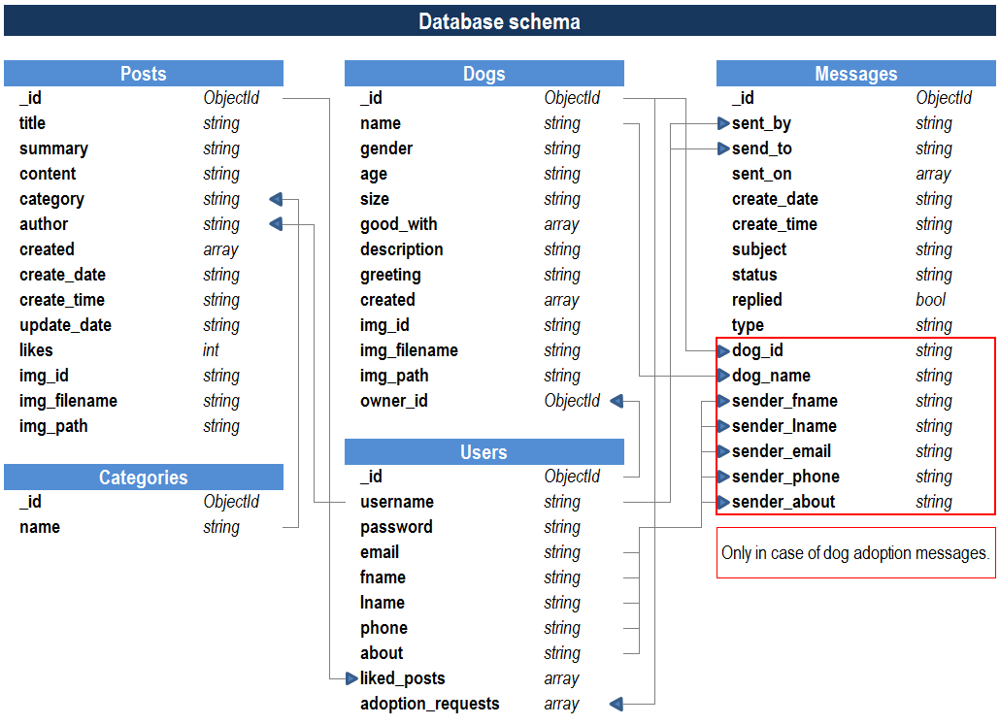

# woof(dot)com

[Click for live website](http://woofdotcom.herokuapp.com/)

**woof(dot)com** is web portal for dog lovers and it is part of my 3nd milestone project in **Code Institute's Full Stack Software Development Course**. This site is intended for all dog lovers to share their posts with community, to find new homes for their dogs in case they can not keep them anymore, and for those who would like to adopt a dog.


---

## 1. USER EXPERIENCE (UX)

### 1.1 User Stories

#### 1.1.1 First time visitors's goals

- *As a first time visitor*, I want to clearly see the purpose of the site and to easily navigate throughout the site

- *As a first time visitor*, I want to see dog content which is divided into easily understandable and well structured sections.

- *As a first time visitor*, I want to be able to use search tools to filter content by specific criteria

- *As a first time visitor*, I want to be able to contact the site owner

- *As a first time visitor*, I want to be able to create account which will give me more options on the site

#### 1.1.2 Frequent user's goals

- *As a frequent user*, I want to be able to write my own content and to share it with other users of the site

- *As a frequent user*, I want to be able to add dogs and their info to the dog database on the site

- *As a frequent user*, I want to be able to edit or delete all the content created by myself at any time

- *As a frequent user*, I want to be able to give positive feedback to other users who are posting their content to the site

- *As a frequent user*, I want to be able to send and withdraw applications for adopting dogs

- *As a frequent user*, I want to be able to easily communicate with site owner or admin

- *As a frequent user*, I want to be able to make changes to my profile

#### 1.1.3 Site owner's goals

- *As a site owner*, I want to provide a platform for users to share their knowledge, experiences, advices and passion for dogs

- *As a site owner*, I want to provide service and support for dog owners to re-home their dogs if they can not keep them for any reason anymore

- *As a site owner*, I want to provide messaging tools between site users and myself as integrated part of the site

- *As a site owner*, I want to promote social media links to grow the community

---

## 2. WIREFRAMES

- [Mobile view](static/documentation/wireframes/mobile.pdf)
- [Tablet view](static/documentation/wireframes/tablet.pdf)
- [Desktop view](static/documentation/wireframes/desktop.pdf)

---

## 3. DATABASE SCHEMA



## 4. TECHNOLOGIES USED

### 4.1 Languages

- [HTML5](https://en.wikipedia.org/wiki/HTML5)
- [CSS3](https://en.wikipedia.org/wiki/CSS) 
- [JavaScript](https://en.wikipedia.org/wiki/JavaScript)
- [Python 3.8](https://en.wikipedia.org/wiki/Python_(programming_language))

### 4.2 Frameworks, libraries, programs and websites

- [Balsamiq](https://balsamiq.com/) was used to create the wireframes during the site design process.

- [jQuery](https://jquery.com/) was used along with JavaScript to manipulate the DOM, CSS and handle JavaScript events in easier way.

- [Flask](https://flask.palletsprojects.com/en/2.0.x/) is a micro web framework written in Python which was used to create this app.

- [Pypi](https://pypi.org/) was used to find and download Python packages.

- [Heroku](https://www.heroku.com/) is a cloud platform which was used to deploy the project.

- [Google Fonts](https://fonts.google.com/) were used to import 'Frederick the Great' and 'Libre Franklin' fonts which were used throughout the site.

- [Amazon Web Services](https://aws.amazon.com/) was used to store images uploaded via forms on the website.

- [Slick](https://kenwheeler.github.io/slick/) is jQuery plugin which was used to create carousel effect.

- [CSS Animate](https://animate.style/) was used to create animated effects.

- [Gitpod](https://www.gitpod.io/) was used to write all the HTML, CSS, JavaScript and Python code for the site.

- [Git](https://git-scm.com/) was used for version control by utilizing the Gitpod terminal to commit to Git and Push to GitHub

- [GitHub](https://github.com/) is used to store the projects code after being pushed from Git.

- [Photopea](https://www.photopea.com/) is free online photo editor which was used to edit and optimize background image, logo and all card images.

- [Redketchup](https://redketchup.io/bulk-image-resizer) was used to convert large number of images.

- [Font Awesome](https://fontawesome.com/) was used to add icons for aesthetic and UX purposes.

- [Autoprefixer](https://autoprefixer.github.io/) was used to add prefixes to CSS properties which are not supported by some browsers.

---

## 5. DESIGN

---

## 6. TESTING

### 6.1 Testing User Stories from User Experience (UX) Section

#### First time visitors's goals

* As a first time visitor, I want to clearly see the purpose of the site and to easily navigate throughout the site.

  -  Theme of the website is visible through it’s name (woofdotcom) and there are various dog photos in banner section throughout the site. Pages have title sections with brief description of the purpose of the page. For first time visitors (unregistered users) there is register section displayed which invites user to create account and explains additional benefits of being a member.

  [Example 1](/static/documentation/testing/user_stories/001.webp)

* As a first time visitor, I want to see dog content which is divided into easily understandable and well structured sections.

  -  On index page there are two sections. First one, section with latest posts, shows 3 most recent posts added to the website. Second section contains 3 most recent dogs advertised for adoption. Both sections have “view more” buttons which redirect users to dedicated page for posts or dog ads. On desktop size, users can browse through different website sections by using tabs which are placed below title/banner. On mobile and tablet those links are part of navigation menu which can be accessed by pressing the toggle button in upper right corner of the page. 

  [Example 2](/static/documentation/testing/user_stories/002.webp)
  [Example 3](/static/documentation/testing/user_stories/003.webp)

* As a first time visitor, I want to be able to use search tools to filter content by specific criteria

  -  On main page dedicated for posts/dogs there is a “filter” button which toggles search controls. Controls consist of text input fields, dropdown select elements, checkboxes, reset and submit buttons. Posts can be filtered by category and author, and they can be sorted by date or popularity (number of likes). Dogs can be filtered by name, gender, age, size, owner preferences, and they are sorted from newest to oldest.

  [Example 4](/static/documentation/testing/user_stories/004.webp)

* As a first time visitor, I want to be able to contact the site owner

  -  Contact us page provides contact form which sends user’s message to admin inbox.

  [Example 5](/static/documentation/testing/user_stories/005.webp)

* As a first time visitor, I want to be able to create account which will give me more options on the site

  -  Register section is displayed on pages throughout the website to unregistered users. Also, there is a link for registration form in navigation menu.

  [Example 6](/static/documentation/testing/user_stories/006.webp)

#### Frequent user's goals

* As a frequent user, I want to be able to write my own content and to share it with other users of the site

  -  Registered users can add their own posts to the website. On desktop size there is navigation tab “Add new post” below the title/banner. On mobile and tablet size this link is in the navigation menu.

  [Example 7](/static/documentation/testing/user_stories/007.webp)

* As a frequent user, I want to be able to add dogs and their info to the dog database on the site

  -  Registered users can add their dog ads to the website. On desktop size there is navigation tab “Surrender a dog” below the title/banner. On mobile and tablet size this link is in the navigation menu. This link redirects users to a page with tips and advices on rehoming a dog, and if user wants to proceed with posting an ad, there is a link on the bottom of the page. However, only registered users with full profile info can post dog ads. If user did not provide full info, flash message is displayed.

  [Example 8](/static/documentation/testing/user_stories/008.webp)
  [Example 9](/static/documentation/testing/user_stories/009.webp)

* As a frequent user, I want to be able to edit or delete all the content created by myself at any time

  -  Registered users can edit or delete own content. On post/dog page there are edit and delete buttons which will display a pop up message for user to confirm the action. 

  [Example 10](/static/documentation/testing/user_stories/010.webp)

* As a frequent user, I want to be able to give positive feedback to other users who are posting their content to the site

  -  Registered users can give positive feedback to other posts by pressing “star icon” on posts page. This action can also be undone by pressing the icon again. Users can not give feedback to own posts.

  [Example 11](/static/documentation/testing/user_stories/011.webp)

* As a frequent user, I want to be able to send and withdraw applications for adopting dogs

  -  Registered users can apply for dog adoption. There is “Apply for adoption” button on the bottom of each dog’s page. However, only registered users with full profile info can apply for dog adoption. If user did not provide full info, flash message is displayed. Once clicked, flash message is displayed to the user, and adoption request message with user’s details is sent to admin. This action can also be undone by pressing the “Withdraw application” button. Users can not send applications for own dogs.

  [Example 12](/static/documentation/testing/user_stories/012.webp)
  [Example 13](/static/documentation/testing/user_stories/013.webp)

* As a frequent user, I want to be able to easily communicate with site owner or admin

  -  Contact us page provides contact form which sends user’s message to admin inbox. Registered users have access to their inbox where they can see all previous messages received from admin. From there they can chose to reply to the message directly.

  [Example 14](/static/documentation/testing/user_stories/014.webp)

* As a frequent user, I want to be able to make changes to my profile

  -  On desktop size there is “Update profile” tab below title/banner. On mobile and tablet sizes there is a link in navigation menu. This link redirects users to the profile page where they can change password or update additional info required for posting dog ads or applying for dog adoption.

  [Example 15](/static/documentation/testing/user_stories/015.webp)

#### Site owner's goals

* As a site owner, I want to provide a platform for users to share their knowledge, experiences, advices and passion for dogs

  -  Registered users can write their own posts and publish them on the website. Posts are divided in categories, which makes it easier for other users to see what is the purpose of the post.

  [Example 16](/static/documentation/testing/user_stories/007.webp)

* As a site owner, I want to provide service and support for dog owners to re-home their dogs if they can not keep them for any reason anymore

  -  Website has a “Surrender dog” page which helps dog owners with tips and advices for abandoning a dog. Owners are encouraged to change their mind and keep the dog, but in case this is not an option they can try to rehome a dog by posting and ad rather than giving the dog straight to the shelter.

  [Example 17](/static/documentation/testing/user_stories/008.webp)

* As a site owner, I want to provide messaging tools between site users and myself as integrated part of the site

  -  Messaging is available only between admin and user. Messages can be sent by contact form or by replying to existing message in inbox. In case of applications for dog adoption, message is generated automatically and sent to admin inbox.

  [Example 18](/static/documentation/testing/user_stories/016.webp)

* As a site owner, I want to promote social media links to grow the community

  -  The footer contains links to the Facebook, Instagram, Twitter, Snapchat  and Youtube websites. Each link will be opened in new tab to ensure that users can easily get back to the website.

  [Example 19](/static/documentation/testing/user_stories/017.webp)

### 6.2 Further testing

* The website was tested on [Google Chrome](/static/documentation/testing/images/chrome.PNG), [Microsoft Edge]((/static/documentation/testing/images/edge.PNG)), [Mozilla Firefox]((/static/documentation/testing/images/firefox.PNG)) and [Opera]((/static/documentation/testing/images/opera.PNG)) browsers.

* The website was viewed on a mobile, tablet and laptop devices such as iPhone XR, Huawei Media Pad T3 and HP Elitebook 840.

  - iPhone XR

  

  - Huawei Media Pad T3

  

  - HP Elitebook 840

  

  

  

  

* The website was tested on desktop and laptop computers on a variety of screen sizes using device toolbar option in Google Chrome developer tools.

  -  Google Chrome developer tools

  

### 6.3 Manual testing

Due to extensive testing, this section is provided in separate file which can be found on the following [link](/static/documentation/testing/TEST.md).

### 6.4 Known bugs

* Website does not work in Internet Explorer 11 which causes page elements to display incorrectly on load, and none of the events work.

* Images are not displaying on older iPhone devices using Safari versions lower than v14 as webp image format is not supported.

### 6.5 Fixed bugs

* On mobile and tablet devices navbar toggle button was disabling scrolling on the page.

Solution:

```
$(".navbar__toggle").click(function () {
    $(".nav__mobile").toggle();
    if ($(".nav__mobile").is(":visible")) {
        disableScroll()
    } else {
        enableScroll()
    }
    $(".nav__mobile").toggle();
    $(".nav__mobile").slideToggle();
})
```

* On mobile and tablet navbar was not hiding properly. This was fixed by adding some test code which calculates position of navbar (image attached), which helped to write javascript code which fixed it.


Solution:

```
let scrollTop = -1; 
let scrollCurrent;
let containerHeight = $(".main-container").height()
let bodyHeight = $("body").height()
let scrollLimit = containerHeight - bodyHeight
$(window).scroll(function() {
    // Hides navbar only if page is higher than screen height
    if (scrollLimit > 0) {
        scrollCurrent = $(window).scrollTop();
        if (scrollCurrent >= scrollTop && scrollCurrent > 80) {
            $(".nav").css("top", "-80px");
        } else if (scrollCurrent > scrollLimit) {
            $(".nav").css("top", "-80px");
        } else {
            $(".nav").css("top", "0");
        }
        scrollTop = scrollCurrent;
    }
})
```
---

## 7. DEPLOYMENT

### 7.1 Creating repository on GitHub

Repository for this project was created using following steps:

1. Sign in to [GitHub account](https://github.com/bencheee) and click on the "New" button in the top right corner of the page


2. Choose Code Institute gitpod template from dropdown menu, type in the repository name and click on "Create repository" button at the bottom of the page


### 7.2 Deploying project on Heroku

This project was deployed to GitHub Pages using following steps:

1. Sign in to [Heroku](https://www.heroku.com/) and create new app by clicking on "New" button in top right corner


2. Choose app name and region and click on "Create app" button


3. Go to "Settings" tab and and click on "Reveal Config Vars" button. Update all variables from env.py file.


4. Click on "Deploy" tab and choose GitHub as deployment method


5. Enter GitHub repository name and click on "Search" button. When repository is loaded click on "Connect" button.


6. Choose main branch and click on "Enable Automatic Deploys" button. Click on "Deploy Branch" button.


*Make sure to have Procfile and requirements.txt updated in project repository, otherwise app will not run.
 
### 7.3 Forking repository

To fork the repository use the following steps:

1. Sign in to GitHub and open [woof(dot)com](https://github.com/bencheee/woofdotcom)

2. Click on the *Fork* icon in the top right corner of the page


### 7.4 Cloning repository

To make a local clone of the repository use the following steps:

1. Sign in to GitHub and open [woofdotcom](https://github.com/bencheee/woofdotcom)

2. At the top of the repository click on the *Code* icon

3. Copy the provided HTTPS link

4. Open Git Bash and change the current working directory to the location where the cloned directory should be made

5. Type *git clone* and then paste the copied URL

```
$ git clone https://github.com/bencheee/woofdotcom.git
```

6. Press *Enter* and local clone of the repository will be created


---

## 8. CREDITS

### 8.1 Acknowledgements

- My mentor Felipe Souza Alarcon for continuous helpful feedback

- Tutor support at Code Institute for their support 